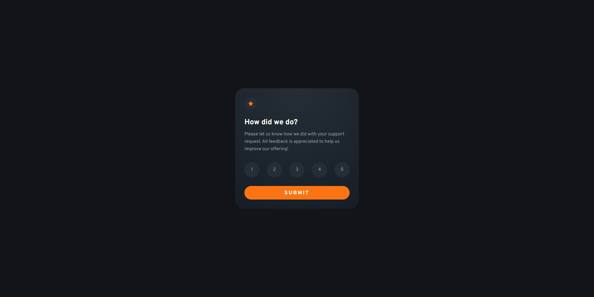
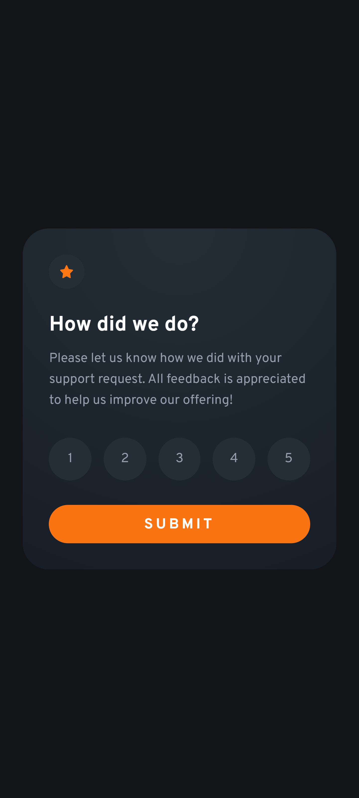
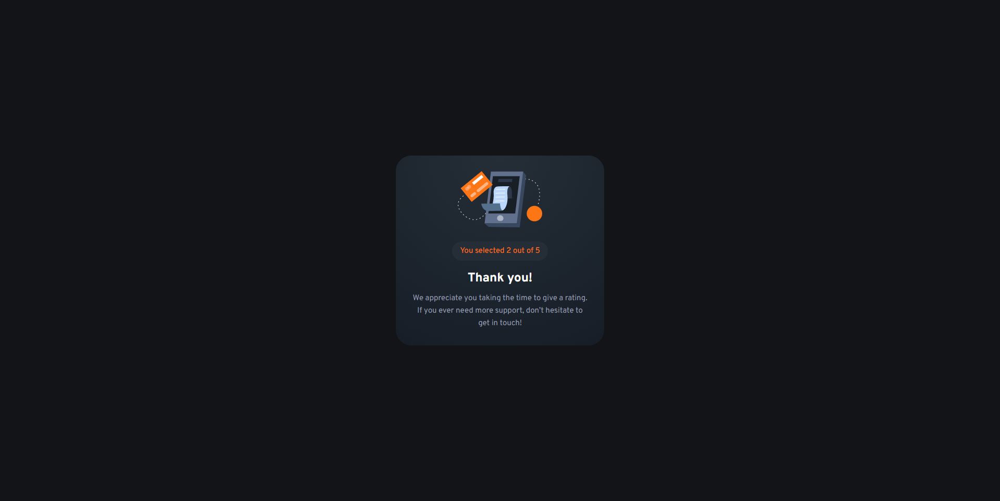
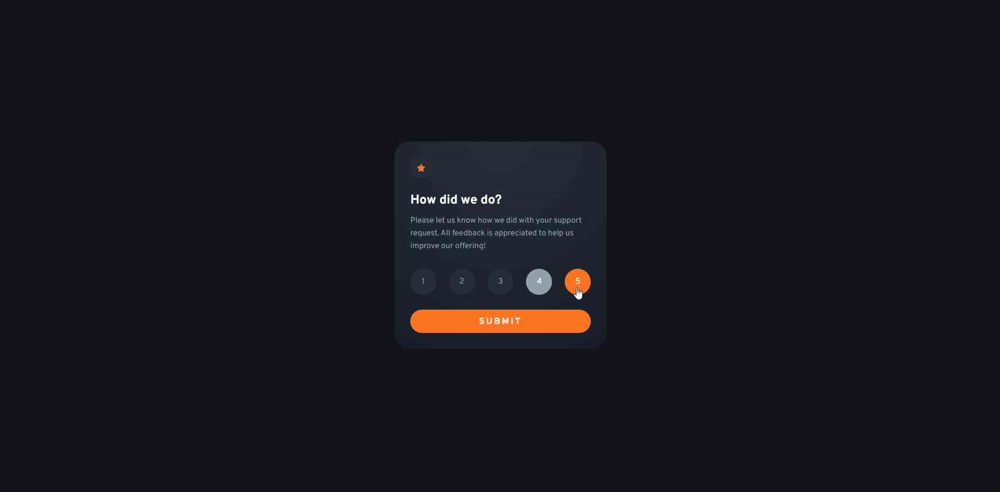

# Frontend Mentor - Interactive rating component solution

This is a solution to the [Interactive rating component challenge on Frontend Mentor](https://www.frontendmentor.io/challenges/interactive-rating-component-koxpeBUmI). Frontend Mentor challenges help you improve your coding skills by building realistic projects. 

## Table of contents

- [Overview](#overview)
  - [The challenge](#the-challenge)
  - [Screenshot](#screenshot)
  - [Links](#links)
- [My process](#my-process)
  - [Built with](#built-with)
  - [What I learned](#what-i-learned)
- [Author](#author)

## Overview

### The challenge

Users should be able to:

- View the optimal layout for the app depending on their device's screen size
- See hover states for all interactive elements on the page
- Select and submit a number rating
- See the "Thank you" card state after submitting a rating

### Screenshots

### Links

- [GitHub repository](https://github.com/LarsiParsii/frontendmentor-challenges/tree/main/interactive-rating-component)
- [Live site](https://larsiparsii.github.io/frontendmentor-challenges/interactive-rating-component)

## My process

### Built with

- Semantic HTML5 markup
- CSS custom properties
- Flexbox
- Vanilla JavaScript
- DOM manipulation (editing classlist, etc.)
- Dynamic webpages (toggling between the rating and the thank you state)

### What I learned

This was much more of a challenge to me! The nature of JavaScript, coming from C/C++, takes some getting used to (e.g. there's no low-level coding such as memory management).
However, some of the provided colors didn't really match what was displayed in the image, and a lot of time was spent replacing/trying to find alternatives.

## Author

- GitHub - [@LarsiParsii](https://github.com/LarsiParsii)
- Frontend Mentor - [@LarsiParsii](https://www.frontendmentor.io/profile/LarsiParsii)